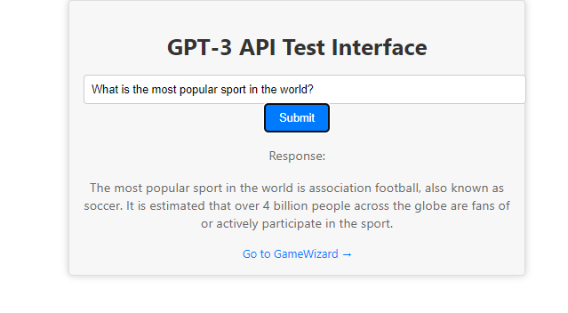
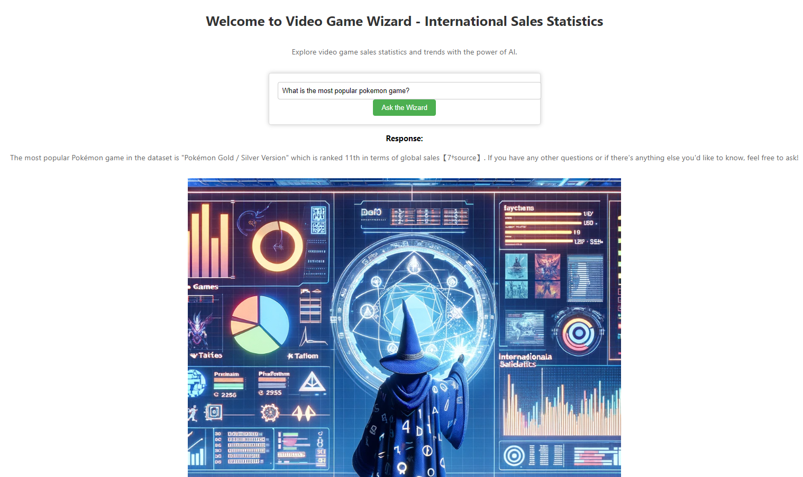

This project contains two chat gpt models integrated into a single web appliaction. First on is a basic gpt 3.5 turbo model that can answer to general questions like the free version of chatgpt. Second one is called the Game Wizard which is trained on a dataset of around 1500 units in json format. The dataset includes video game sales data between years 1989 and 2012. More info about the dataset is found further down this readme file.

Basic gpt 3.5 turbo API search:

Game Wizard - Trained custom gpt model using OpenAI assistant API: 

Frontend initiation:
  -	Create a file called .env in the root of the ‘client’ folder and type the next in it without any extra spaces or other symbols
    -	REACT_APP_BACKEND_URL=http://localhost:3001
  -	Change directory location to: WebsiteGPT\client
    -	Type in terminal -> Npm start

Backend initiation:
  -	Create a file called .env in the root of the ’server’ folder and type the next in it without any extra spaces or other symbols
    -	OPENAI_API_KEY=-<your_openai_api_key>
  -	PORT=3001
    -	Change directory location to: WebsiteGPT\server
    	- Type in terminal -> Node app.js

Setting up the OpenAI Assistant:
  -	Make your own assistant at https://platform.openai.com/assistants
    -	This version is powered by gpt-3.5-turbo-1106 model.
      -	Gpt4 model is very expensive to use since it uses a lot of tokens for every query.
  -	Remember to enable these tools to the assistant in the OpenAI assistant configuration page.
      -	Retrieval
      -	Code interpreter
  -	Get OpenAI API-key from 
    -	https://platform.openai.com/api-keys
      -	The API key is displayed only once remember to keep it safe.

Setting up the Python assistant_service:
  -	Create a file called .env in the root of the project folder and type the next in it without any extra spaces or other symbols
    -	OPENAI_API_KEY=<your_openai_api_key>
  -	ASSISTANT_ID=<your_assistant_id>
    -	Run the assistant_service.py file

My dataset is from https://www.kaggle.com/datasets/thedevastator/global-video-game-sales-and-reviews ¬¬– Credits to Andy Bramwell
  -	The data is converted to JSON format and attached to the assistant
    -	The json data is included in the root of the python project called csvjson.json in case you want to use it with your assistant as well 

This prototype can answer only to simple questions based on the dataset like:
  -	What is the rank 1 game globally?
  -	What is the most popular Pokémon game?

If there are more complicated analytical questions where the assistant must do multiple queries to the dataset the assistant will answer several times before the final answer is ready.
This prototype does not support or render these kinds of questions in the frontend, but you can test the assistant at the OpenAI playground: https://platform.openai.com/playground

Relevant documentation
  -	OpenAI Python API library
    -	https://github.com/openai/openai-python
  -	v1.0.0 Migration Guide #742
    -	https://github.com/openai/openai-python/discussions/742
  -	OpenAI Assistants
    - https://platform.openai.com/docs/api-reference/assistants
